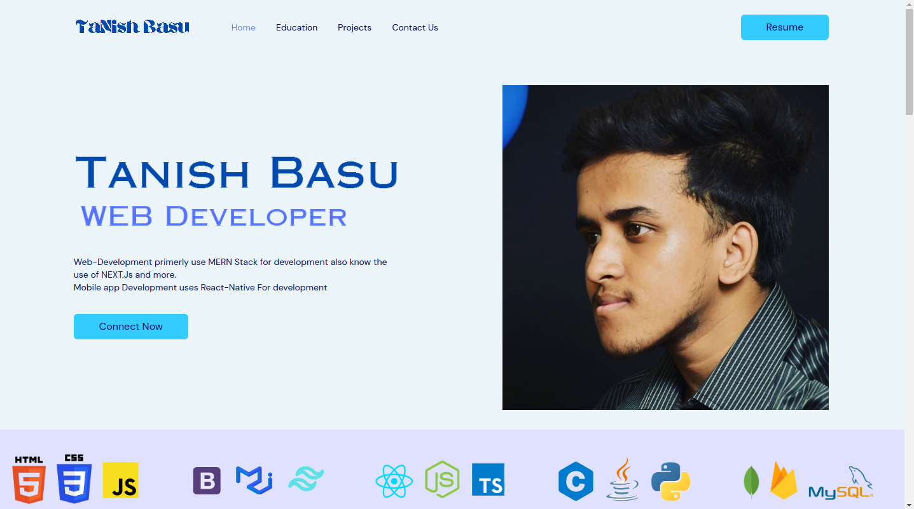

# Portfolio-old

## This is a old portfolio Website I used feel free to use it as you want (If you find it that is)
### To copy it Open your Terminal and Run the commands
```
cd desktop
git clone https://github.com/TanishBasu2002/Portfolio-old.git
cd Portfolio-old
npm install
npm run dev
```
### To open it in VSCode write 
```
code. 
```
#### without closing the terminal
This might not work if you dont have if you don't have
##### git and Node installed in your pc
